# Fiverr Fake-Order Scam: SOC Investigation

**Case 01** | Investigator: Mudasir Zia (CyberBros435) | Date of incident: 02 Oct 2026 | Verdict: **Malicious, phishing / card-harvesting**

## 1. Summary (in simple words)

A brand-new Fiverr account messaged me saying it had placed an order and finished everything. It sent a file named 'My Project' as the 'project'. The file is a small HTML page, not a project. When opened, it shows a fake 'Fiverr Congratulations' screen, then sends the victim to a fake payment site (finish-payments[.]com). That site pretends to be Fiverr, says 'the buyer has paid', and a fake 'support agent' asks the seller to enter their **bank card details** to 'receive the money'. That is how the scammer steals card data.

Two antivirus scanners showed **0 detections**. The file is still malicious because it does not infect the computer. It tricks the person. Antivirus can miss this kind of attack.

| Item | Finding |
|---|---|
| Attack type | Social engineering / phishing delivered through a marketplace chat |
| Goal | Steal payment card details from freelancers |
| Delivery | HTML file attachment sent in Fiverr inbox |
| Impact on me | None. No card data was entered (form fields are empty in screenshot 7) |
| Action taken | Reported to Fiverr and blocked the sender |

## 2. Case details

| Field | Value |
|---|---|
| Sender account | wes9052_uy (profile says: Kenya, on Fiverr since Sept 2026) |
| First contact | 02 Oct 2026, 19:34 (Fiverr inbox time). First conversation with this person |
| Messages | 'Hello' / 'I have placed the order for your service now' / 'Everything has been completed from my side already' / 'Please check the project. I sent it below. Thank you.' |
| Attachment | My Project 2026-10-02 at 14.34.13.html (266.81 KB) |
| SHA-256 | `87121be5291c3746668bf2f2831ef1aaae8c4fddceff477498063571fc9a6725` |
| Real order? | No. Seller dashboard shows 'No active orders' (screenshot 15) |

## 3. Investigation step by step

### Step 1: The message looks wrong from the start

The sender is a new account with no history. It says an order is placed and 'completed' in the same minute. On real Fiverr, a buyer does not 'complete' work for a seller. The only 'order' is a file in chat.

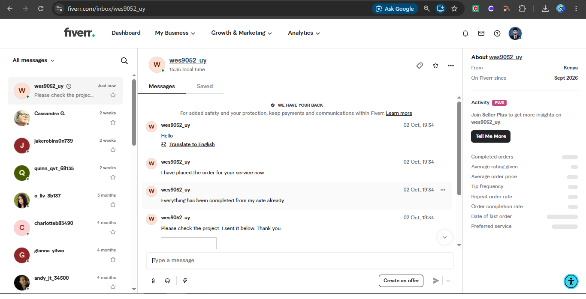

*Screenshot 1: Unsolicited first message from a brand-new account claiming an order was placed*

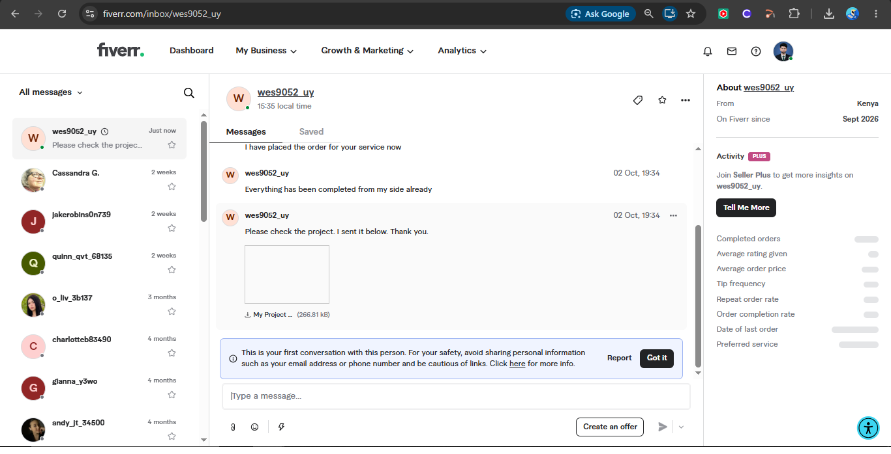

*Screenshot 2: Chat shows an attachment called 'My Project' (266.81 KB) sent as the 'finished project'*

### Step 2: Fiverr warns before download

Fiverr shows its own warning: only download files that match your order. There is no order, so this warning already tells us not to trust the file.

*Screenshot 3: Fiverr's own download warning appears before the file is downloaded*

### Step 3: The file is a fake Fiverr page

I opened the HTML file in the browser. It is a local file (the address starts with C:/Users/...), but it is styled like Fiverr and says 'The buyer has purchased your service'. A countdown then redirects the victim automatically. Real Fiverr never sends you a web page file like this.

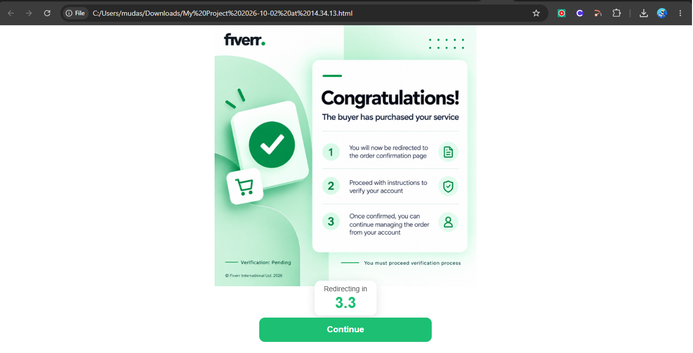

*Screenshot 4: Opening the HTML file locally shows a fake Fiverr 'Congratulations' page with an auto-redirect countdown*

### Step 4: Redirect to a fake payment site

The countdown ends on **finish-payments[.]com**. This is not a Fiverr domain. The first screen says 'Performing security verification', which makes it look safe and professional. Sitting behind Cloudflare does not make a site legitimate. Anyone can use it.

![Screenshot 5: After the countdown, the browser lands on finish-payments[.]com behind a 'security verification' screen](screenshots/05-finish-payments-security-check.png)

*Screenshot 5: After the countdown, the browser lands on finish-payments[.]com behind a 'security verification' screen*

### Step 5: Fake order page with a fake support agent

The page copies Fiverr's look: a 'cybersecurity mentor' gig, price EUR 56, status 'Customer has paid for your service' and a **Get funds** button. A chat bubble signed 'Emma, Customer Support' says the seller must add a card for 'one-time secure identification' before money is released.

This is the trick: the victim thinks they are *receiving* money, but they are *giving* card details. Fiverr pays sellers through the Fiverr balance and normal withdrawal methods. It does not ask you to type a card number to get paid.

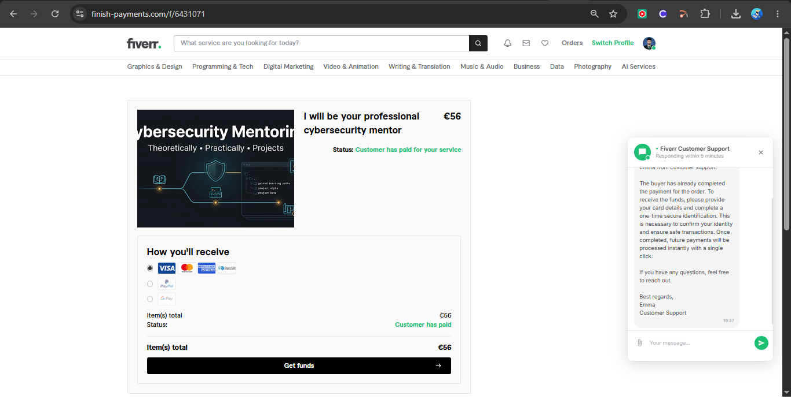

*Screenshot 6: Fake Fiverr order page: 'Customer has paid', plus a fake 'Customer Support' chat asking for card details*

### Step 6: Card-harvesting form

Clicking the button opens 'Add a bank card' and asks for card number, expiry, CVC and cardholder name. It adds trust words like 'PCI DSS' and, in the chat, 'No data is stored on our servers'. These are lies used to calm the victim. **I did not enter any data.**

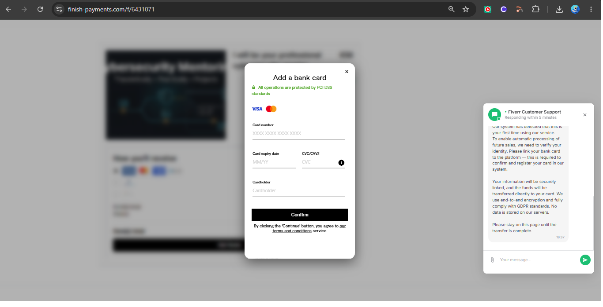

*Screenshot 7: 'Add a bank card' form asking for card number, expiry, CVC and cardholder name*

### Step 7: Reading the HTML source code

I opened the file in VS Code (Restricted Mode, so nothing runs) to see how it works. Findings:

- **Hard-coded redirect** to a raw IP address (no domain name): `hxxp://192[.]162[.]199[.]171/go?id=7f3a91c8...e5f678`
- **Image loaded from the same IP**: `hxxp://192[.]162[.]199[.]171/image.png` (for non-Apple devices)
- **Device check** (`isAppleDevice()` reads the browser user-agent), so the scammer can treat iPhone/Mac users differently
- **Timers**: 6-second countdown and a forced redirect after 8 seconds even if the image fails to load

Why this matters: a raw IP with `/go?id=<long token>` is typical of a tracking / redirect step that identifies each victim before sending them to the next page.

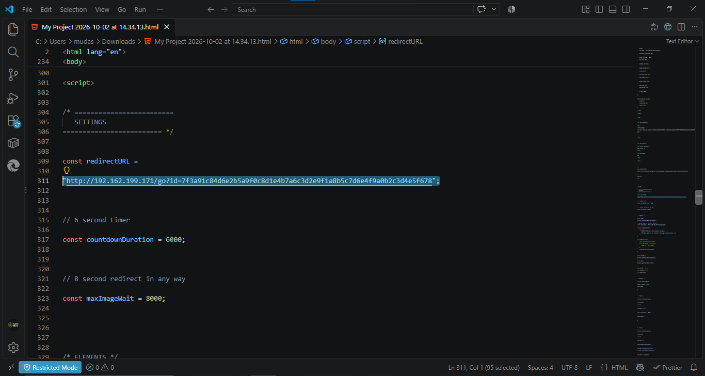

*Screenshot 8: HTML source in VS Code (Restricted Mode): hard-coded redirect to a raw IP address*

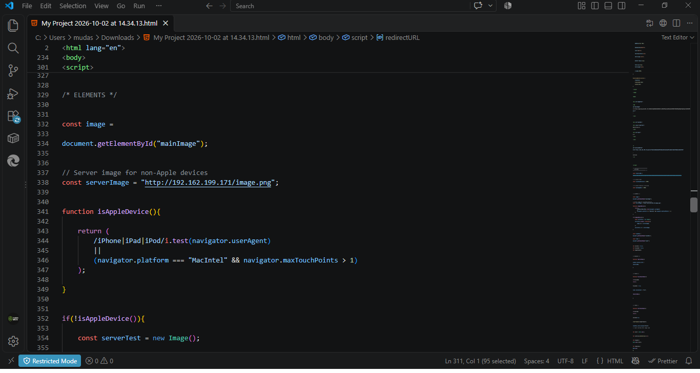

*Screenshot 9: Source: image loaded from the same raw IP, with an Apple-device check*

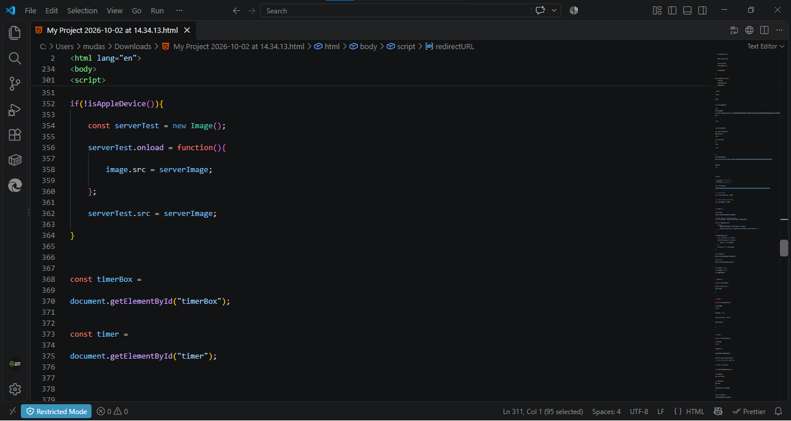

*Screenshot 10: Source: server test, 6-second timer and a forced 8-second redirect*

### Step 8: Scanning the file

I uploaded the file to VirusTotal and Internxt. Both show nothing. On VirusTotal the file is tagged **html, contains-embedded-js, base64-embedded**, and 'last analysis' shows about 10 days ago, which means this same file had already been submitted by someone else before me. It is circulating.

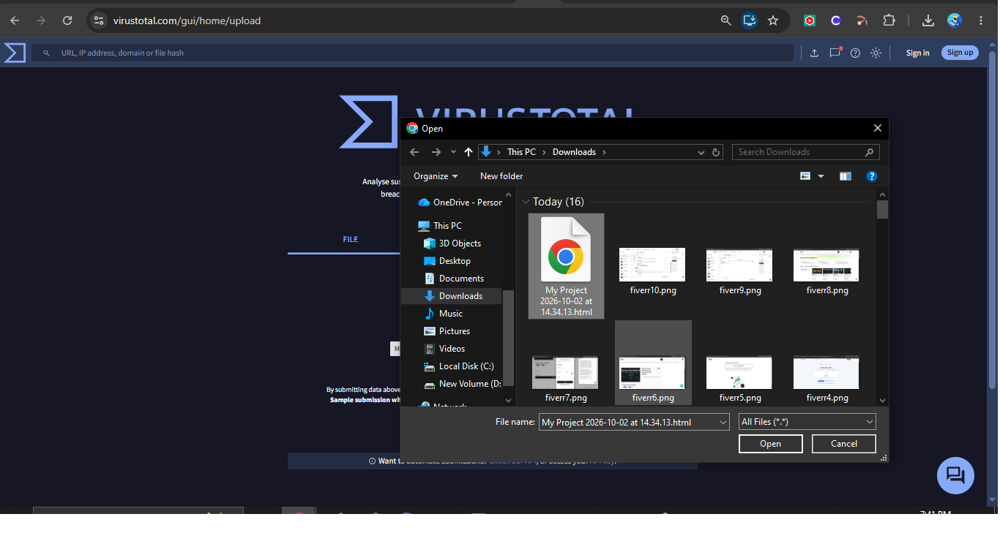

*Screenshot 11: Uploading the file to VirusTotal*

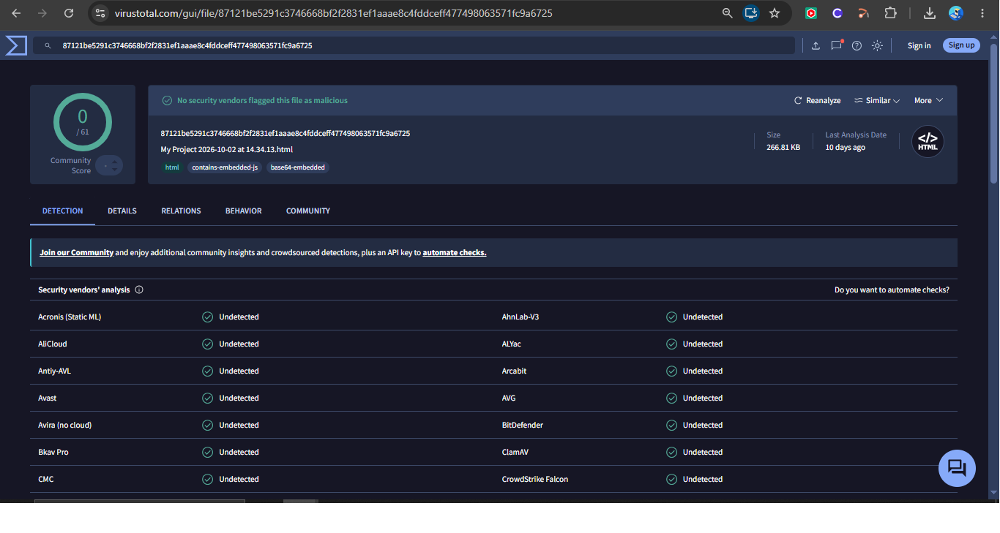

*Screenshot 12: VirusTotal: 0 detections, but tags show embedded JS and base64 content*

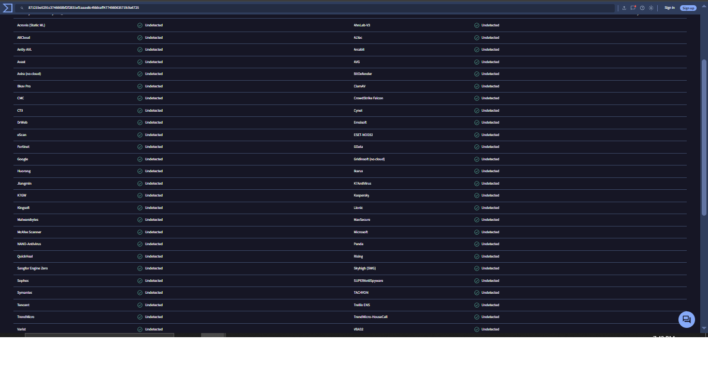

*Screenshot 13: VirusTotal vendor list: every engine says 'Undetected'*

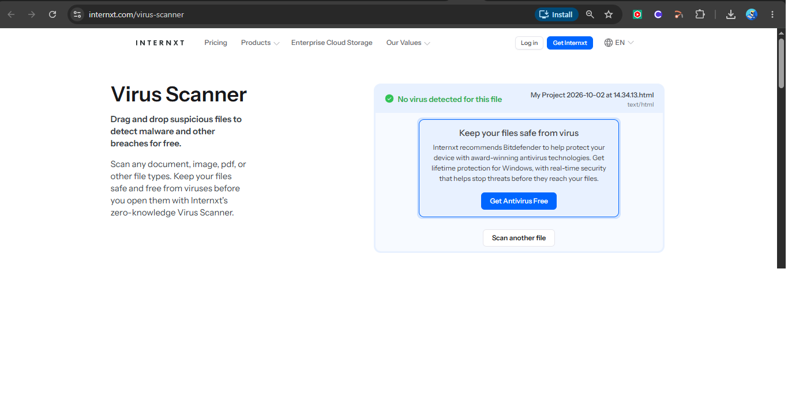

*Screenshot 14: Second scanner (Internxt) also reports nothing*

**Lesson:** 0 detections does not mean safe. This file has no virus code. Its danger is the story it tells. Scanners look for malware, not for lies.

### Step 9: Report and block

I reported the message to Fiverr (reason: asked for payment / communication outside Fiverr is the closest option) and blocked the user. The dashboard behind the dialog confirms there were no active orders.

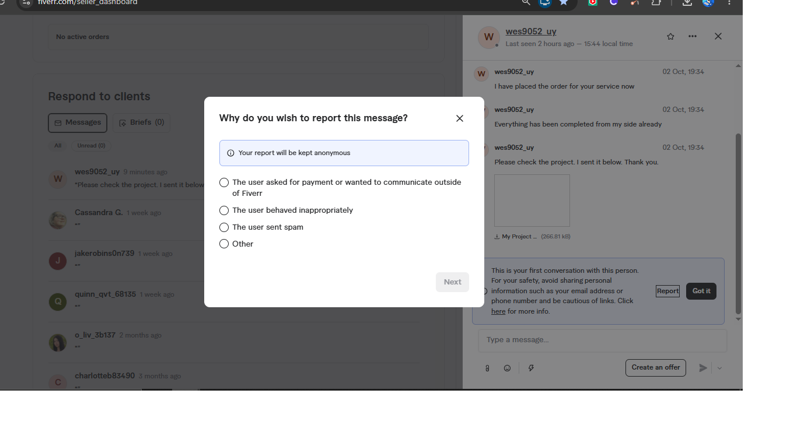

*Screenshot 15: Reporting the message to Fiverr. Dashboard behind it shows 'No active orders'*

*Screenshot 16: Report submitted and sender blocked*

## 4. Indicators of Compromise (defanged)

Defanged means broken on purpose so they cannot be clicked by accident. Do not visit these.

| Type | Value | Note |
|---|---|---|
| Account | wes9052_uy | Fiverr sender, new account |
| Domain | finish-payments[.]com | Fake payment page |
| URL path | finish-payments[.]com/f/6431071 | Fake order page |
| IP | 192[.]162[.]199[.]171 | Redirect + image host (verify reputation) |
| URL | hxxp://192[.]162[.]199[.]171/image.png | Image fetched by the page |
| URL | hxxp://192[.]162[.]199[.]171/go?id=... | Redirect/tracking (full ID visible in screenshot 8) |
| File | My Project 2026-10-02 at 14.34.13.html | 266.81 KB |
| SHA-256 | 87121be5291c3746668bf2f2831ef1aaae8c4fddceff477498063571fc9a6725 | HTML with embedded JS + base64 |

## 5. Why this is a scam: red flags

- Brand-new account, first conversation, no history
- Claims an order exists, but dashboard shows **No active orders**
- Sends an HTML file instead of normal deliverables
- Payment page is on a **different domain**, not fiverr.com
- A 'support agent' appears inside a third-party page, not inside Fiverr
- Asks for **card details to receive money** (money only flows the other way)
- Pressure and urgency: countdowns, auto-redirects, 'stay on this page until transfer is complete'
- Profile time zone looks inconsistent with the claimed country (sender local time showed 15:35 while my inbox time was about 19:34 in Pakistan, a 4-hour gap. Kenya is only 2 hours behind Pakistan, so about 17:35 was expected). Low confidence: a VPN or profile setting could cause this. Treat as a minor clue only.

## 6. MITRE ATT&CK mapping

| ID | Tactic | Technique | Where seen |
|---|---|---|---|
| T1566.003 | Initial Access | Phishing: Spearphishing via Service | Fiverr chat message |
| T1204.002 | Execution | User Execution: Malicious File | Victim must open the HTML file |
| T1036 | Defense Evasion | Masquerading | Fake Fiverr pages and fake support agent |
| T1027 | Defense Evasion | Obfuscated Files or Information | Base64-embedded content in HTML |
| T1583.001 | Resource Development | Acquire Infrastructure: Domains | finish-payments[.]com |
| T1657 | Impact | Financial Theft | Card-harvesting form |

## 7. Verdict and response

**Verdict: Malicious. Severity: High for freelancers (financial theft). Escalate: YES, to the platform.**

- Reported the account to Fiverr and blocked it (done)
- Did not enter any card data (confirmed by screenshots)
- Next: check the IP and domain reputation (VirusTotal, urlscan.io, AbuseIPDB) and report the domain to its registrar and Cloudflare abuse form

## 8. How to protect yourself

- A real buyer cannot 'send you the project' to get paid. Work goes from seller to buyer, through the order page only
- Check that an order exists in your dashboard before opening anything
- Never type card details to 'receive' money. Receiving never needs a card number
- Check the domain in the address bar. If it is not fiverr.com, stop
- Never open unknown HTML files on your main computer. Use a virtual machine or just read the source in a text editor
- Report the message to the platform and block the sender

## 9. What I learned

- Static scanners miss pure social-engineering pages. Reading the source code found the real behaviour
- IOC extraction (domain, IP, hash, URL paths) and defanging are the same steps a SOC analyst does on a phishing alert
- Mapping to MITRE ATT&CK turns a story into a standard report

*Limits of this report: I did not visit the live redirect IP, and I did not check its reputation yet. IP and domain ownership are not claimed here.*
